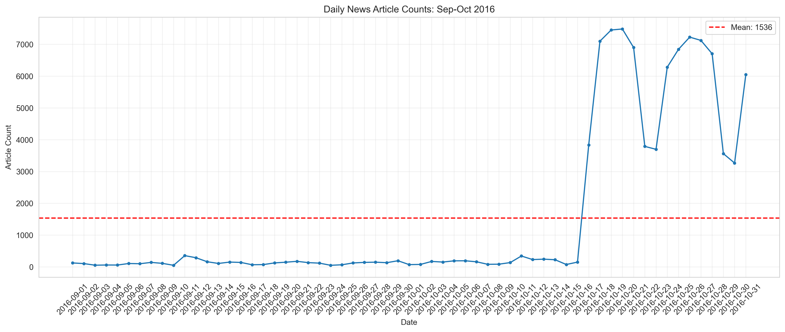
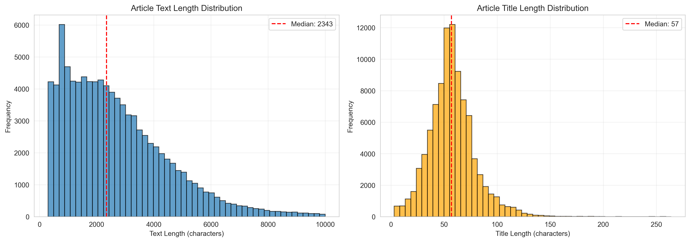
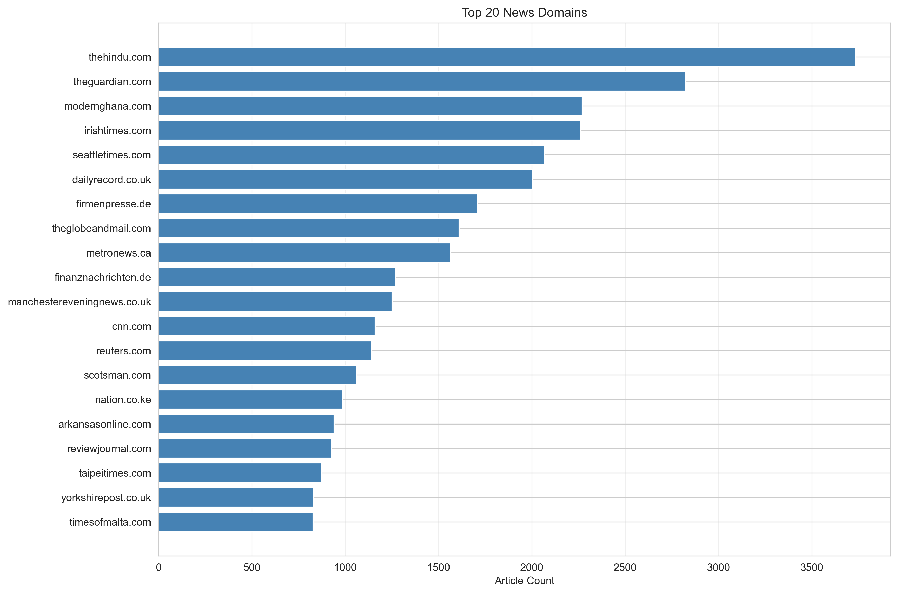

# News Dataset Quality Control Report

**Dataset Period:** September - October 2016
**Report Generated:** 2025-12-19 09:25:53
**Source:** CC-NEWS via HuggingFace

---

## 1. Executive Summary

- **Total Articles:** 93,669
- **Date Range:** 2016-09-01 to 2016-10-31
- **Temporal Coverage:** 61/61 days (100.0%)
- **Unique Domains:** 1,957
- **Language:** 100.00% English

---

## 2. Temporal Coverage

- **Expected Days:** 61 (2016-09-01 to 2016-10-31)
- **Actual Days:** 61
- **Coverage:** 100.0%
- **Status:** ✓ Complete coverage (no missing dates)

### Daily Article Counts

- **Mean:** 1535.6 articles/day
- **Median:** 150 articles/day
- **Range:** 50 - 7481 articles/day
- **Std Dev:** 2593.0

📊 **See detailed table:** [daily_article_counts.csv](tables/daily_article_counts.csv)

---

## 3. Text Length Analysis

### Article Text

- **Mean Length:** 2699 characters
- **Median Length:** 2343 characters
- **Range:** 300 - 9,997 characters

### Article Titles

- **Mean Length:** 58 characters
- **Median Length:** 57 characters
- **Range:** 3 - 264 characters

---

## 4. Domain/Source Analysis

- **Unique Domains:** 1,957
- **Top Domain:** thehindu.com (3,735 articles)

### Top 10 Domains

1. **thehindu.com**: 3,735 articles
2. **theguardian.com**: 2,825 articles
3. **modernghana.com**: 2,269 articles
4. **irishtimes.com**: 2,263 articles
5. **seattletimes.com**: 2,067 articles
6. **dailyrecord.co.uk**: 2,005 articles
7. **firmenpresse.de**: 1,710 articles
8. **theglobeandmail.com**: 1,610 articles
9. **metronews.ca**: 1,566 articles
10. **finanznachrichten.de**: 1,269 articles

📊 **See full list:** [top_30_domains.csv](tables/top_30_domains.csv)

---

## 5. Language Distribution

- **English:** 93,669 articles (100.00%)
- **Status:** ✓ All articles are in English

---

## 6. Data Completeness

### Required Fields

- ✓ **date**: Complete (0 missing)
- ✓ **title**: Complete (0 missing)
- ✓ **plain_text**: Complete (0 missing)
- ✓ **requested_url**: Complete (0 missing)

---

## 7. Summary

### Dataset Quality Assessment

✓ **Temporal Coverage:** 100.0% (61/61 days)
✓ **Dataset Size:** 93,669 articles
✓ **Language Quality:** 100.00% English
✓ **Source Diversity:** 1,957 unique domains
✓ **Data Completeness:** All required fields present

### Files Generated

- `summary_statistics.json` - Complete statistics in JSON format
- `figures/daily_article_counts.png` - Daily counts visualization
- `figures/text_length_distribution.png` - Text length analysis
- `figures/top_domains.png` - Top domains visualization
- `tables/daily_article_counts.csv` - Daily counts data
- `tables/top_30_domains.csv` - Top 30 domains data

---

**Report completed:** 2025-12-19 09:25:53