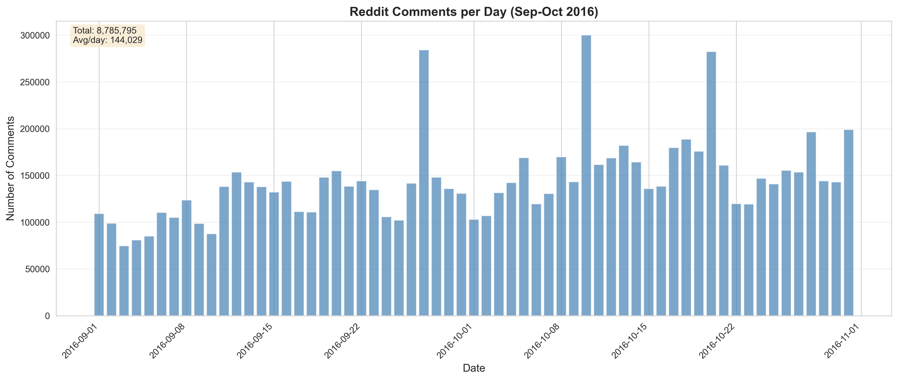
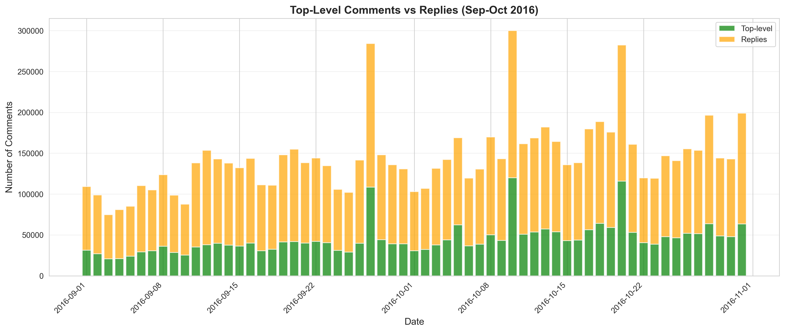
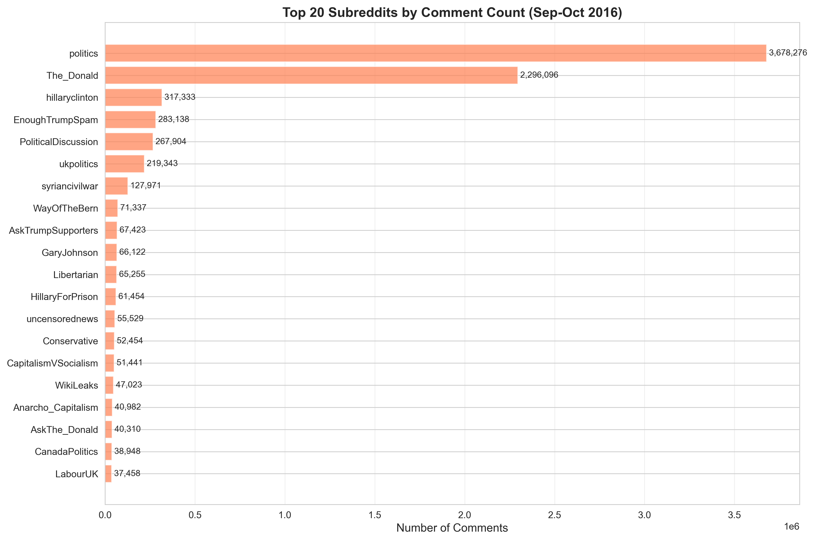
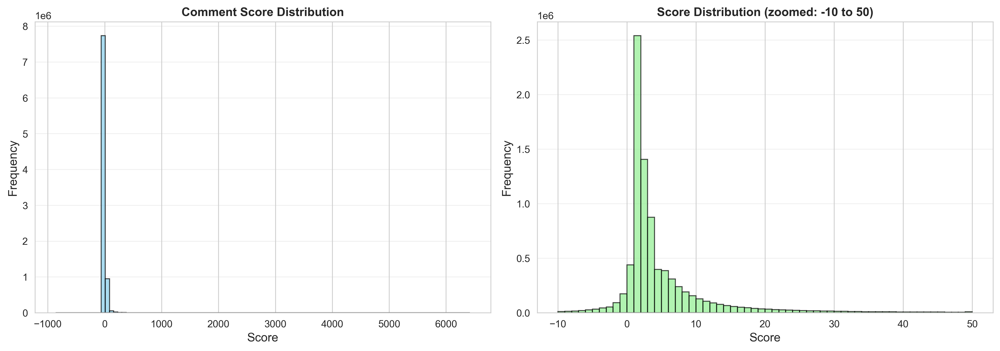

# Reddit Dataset QC Report

**Period:** September 1 - October 31, 2016 (61 days)  
**Generated:** 2025-12-18 15:42:04  
**Source:** Reddit Politosphere Dataset (Zenodo DOI: 10.5281/zenodo.5851729)

---

## 1. Data Processing Pipeline

### Silver Layer (Filtered & Deduplicated)
- **Total lines read:** 9,795,457
- **Successfully parsed:** 9,795,457
- **After filtering:** 8,787,694
- **After deduplication:** 8,785,795
- **Duplicates removed:** 1,899

### Gold Layer (Thread Context Added)
- **Total comments:** 8,785,795
- **Thread coverage:** 100.0%
- **Files written:** 61

---

## 2. Temporal Coverage

- **Date range:** 2016-09-01 to 2016-10-31
- **Total days:** 61
- **Missing dates:** None (100% coverage)

### Daily Statistics
- **Average comments per day:** 144,029
- **Min comments per day:** 74,731 (2016-09-03)
- **Max comments per day:** 300,025 (2016-10-10)



---

## 3. Comment Types

- **Total top-level comments:** 2,749,855 (31.3%)
- **Total replies:** 6,035,940 (68.7%)



---

## 4. Content Distribution

### Subreddits
- **Unique subreddits:** 364
- **Top 5 subreddits:**
  1. **politics**: 3,678,276 comments (41.87%)
  2. **The_Donald**: 2,296,096 comments (26.13%)
  3. **hillaryclinton**: 317,333 comments (3.61%)
  4. **EnoughTrumpSpam**: 283,138 comments (3.22%)
  5. **PoliticalDiscussion**: 267,904 comments (3.05%)



### Authors
- **Average unique authors per day:** 33,388
- **Average unique threads per day:** 10,936

---

## 5. Engagement Metrics

### Comment Scores
- **Mean score:** 7.49
- **Median score:** 2
- **Min score:** -862
- **Max score:** 6,420



### Comment Length
- **Average comment length:** 225 characters

---

## 6. Data Quality Checks

✅ **Complete temporal coverage:** All 61 days present  
✅ **Thread context:** 100% of comments have thread_id  
✅ **Deduplication applied:** 1,899 duplicates removed  
✅ **Filters applied:** Deleted comments, bots, min length (10 chars)  
✅ **Timestamp integrity:** All comments use created_utc (not thread time)

---

## 7. Configuration

### Time Indexing
- **Field:** `created_utc`
- **Thread context usage:** `inference_only`

### Filters Applied
- **Language:** en
- **Min comment length:** 10 characters
- **Remove deleted:** True
- **Remove bots:** True

### Deduplication
- **Method:** exact_match
- **Key fields:** author, body, created_utc

---

## 8. Data Files

### Output Structure
```
data/01_silver/reddit/          # Filtered & deduplicated
  ├── 2016-09-01.parquet
  ├── ...
  └── 2016-10-31.parquet

data/03_gold/reddit/            # With thread context
  ├── 2016-09-01.parquet
  ├── ...
  └── 2016-10-31.parquet
```

### File Format
- **Format:** Parquet with Snappy compression
- **Partitioning:** Daily (one file per date)
- **Total files:** 61

---

**Report generated by:** `notebooks/reddit/13_reddit_dataset_qc_report.ipynb`
